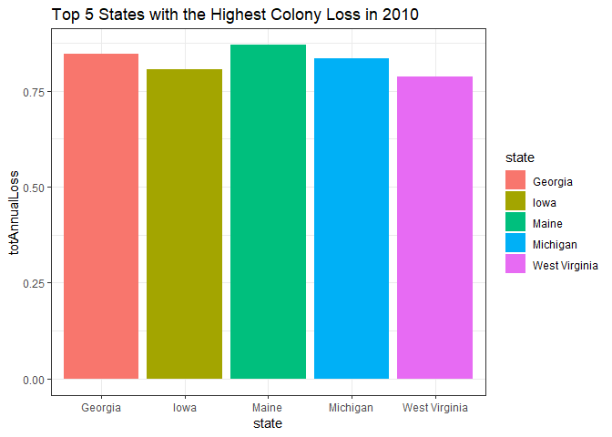
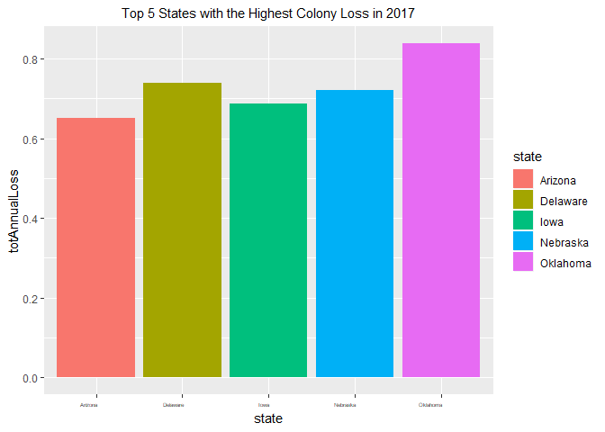
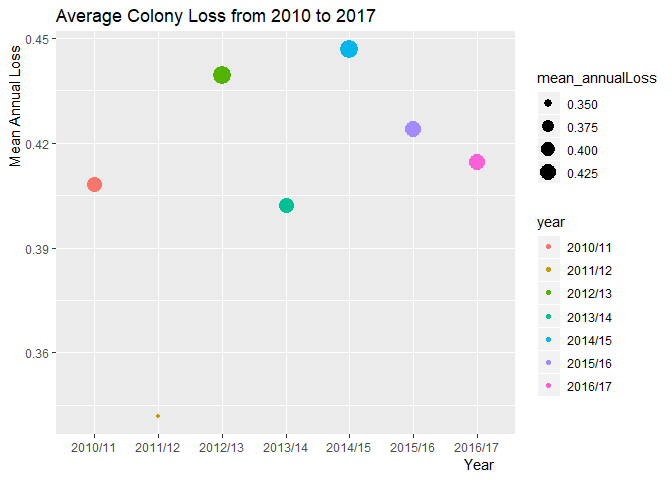

```r
##install.packages("tidyverse")
##install.packages("skimr")
##install.packages("RColorBrewer")
library("RColorBrewer")
library(tidyverse)
```

```
## Warning: package 'tidyverse' was built under R version 3.5.3
```

```
## -- Attaching packages --------------------------------------- tidyverse 1.2.1 --
```

```
## v ggplot2 3.1.0     v purrr   0.2.5
## v tibble  2.0.1     v dplyr   0.7.8
## v tidyr   0.8.2     v stringr 1.3.1
## v readr   1.3.1     v forcats 0.3.0
```

```
## -- Conflicts ------------------------------------------ tidyverse_conflicts() --
## x dplyr::filter() masks stats::filter()
## x dplyr::lag()    masks stats::lag()
```

```r
library(skimr)
```

```
## Warning: package 'skimr' was built under R version 3.5.3
```

```
## 
## Attaching package: 'skimr'
```

```
## The following object is masked from 'package:stats':
## 
##     filter
```


```r
bee <- 
  readr::read_csv("C:/Users/JIN/Downloads/Animals-master/Jade's/bee2.csv")
```

```
## Parsed with column specification:
## cols(
##   Year = col_character(),
##   Season = col_character(),
##   State = col_character(),
##   `Total Annual Loss` = col_double(),
##   Beekeepers = col_double(),
##   `Beekeepers Exclusive to State` = col_double(),
##   Colonies = col_double(),
##   `Colonies Exclusive to State` = col_double()
## )
```

```r
bee
```

```
## # A tibble: 365 x 8
##    Year  Season State `Total Annual L~ Beekeepers `Beekeepers Exc~ Colonies
##    <chr> <chr>  <chr>            <dbl>      <dbl>            <dbl>    <dbl>
##  1 2016~ Annual Mass~            0.159         87            0.943    27186
##  2 2016~ Annual Mont~            0.171         21            0.524    35905
##  3 2016~ Annual Neva~            0.23          13            0.923     2512
##  4 2016~ Annual Maine            0.233         65            0.938    41102
##  5 2016~ Annual Wyom~            0.234         18            0.778     6521
##  6 2016~ Annual Hawa~            0.262         10            1           84
##  7 2016~ Annual Miss~            0.263          9            0.222    17802
##  8 2016~ Annual West~            0.266         52            0.942      993
##  9 2016~ Annual Idaho            0.273         30            0.833    76794
## 10 2016~ Annual Flor~            0.292         62            0.823    95872
## # ... with 355 more rows, and 1 more variable: `Colonies Exclusive to
## #   State` <dbl>
```


```r
names(bee)
```

```
## [1] "Year"                          "Season"                       
## [3] "State"                         "Total Annual Loss"            
## [5] "Beekeepers"                    "Beekeepers Exclusive to State"
## [7] "Colonies"                      "Colonies Exclusive to State"
```

## Renaming the colnames

```r
bee <- 
  bee %>% 
  dplyr::rename(
          year        = "Year",
          season      = "Season",
          state       = "State",
          totAnnualLoss = "Total Annual Loss",
          beekeepers = "Beekeepers",
          beekeepersExclusive = "Beekeepers Exclusive to State",
          colonies = "Colonies",
          coloniesExclusive =  "Colonies Exclusive to State" 
   )
```

##Is it true bees are losing?

```r
bee_2010<- 
  bee %>%
  filter(year =="2010/11") %>% 
  arrange(desc(totAnnualLoss))
bee_2010
```

```
## # A tibble: 53 x 8
##    year  season state totAnnualLoss beekeepers beekeepersExclu~ colonies
##    <chr> <chr>  <chr>         <dbl>      <dbl>            <dbl>    <dbl>
##  1 2010~ Annual Maine         0.869         43            0.93      5668
##  2 2010~ Annual Geor~         0.847         61            0.967     5923
##  3 2010~ Annual Mich~         0.835         99            0.97     10320
##  4 2010~ Annual Iowa          0.807         14            0.857     1037
##  5 2010~ Annual West~         0.786         25            0.92       509
##  6 2010~ Annual Penn~         0.728        218            0.973     8640
##  7 2010~ Annual New ~         0.681         79            0.848     8197
##  8 2010~ Annual Loui~         0.636         13            0.846     6153
##  9 2010~ Annual Mass~         0.607         81            0.938      539
## 10 2010~ Annual Illi~         0.583         57            0.947     1019
## # ... with 43 more rows, and 1 more variable: coloniesExclusive <dbl>
```

## Top 5 states with the highest colony loss in 2010

```r
bee_2010 %>% 
  filter(totAnnualLoss >=0.75) %>% 
  ggplot(aes(state, totAnnualLoss, fill = state))+
  geom_col()+
  labs(title= "Top 5 States with the Highest Colony Loss in 2010")+
  theme(axis.text.x = element_text(hjust= 0.95, size=rel(0.5)))+
  theme(plot.title = element_text(size = rel(1), hjust = 0.5))+
  theme_bw()
```

<!-- -->

##In the most recent year 2016-2017

```r
bee_2016<-
  bee %>% 
  filter(year =="2016/17") %>% 
  arrange(desc(totAnnualLoss))
bee_2016
```

```
## # A tibble: 51 x 8
##    year  season state totAnnualLoss beekeepers beekeepersExclu~ colonies
##    <chr> <chr>  <chr>         <dbl>      <dbl>            <dbl>    <dbl>
##  1 2016~ Annual Okla~         0.839         29            0.965     9513
##  2 2016~ Annual Dela~         0.74          38            0.868      462
##  3 2016~ Annual Nebr~         0.721         15            0.933      355
##  4 2016~ Annual Iowa          0.686         71            0.986     1074
##  5 2016~ Annual Ariz~         0.65          10            0.8        528
##  6 2016~ Annual Conn~         0.618         34            1          427
##  7 2016~ Annual New ~         0.604         49            0.939      757
##  8 2016~ Annual Illi~         0.59          94            0.979      906
##  9 2016~ Annual Mary~         0.55         127            0.905     5582
## 10 2016~ Annual Sout~         0.538         53            0.943     6246
## # ... with 41 more rows, and 1 more variable: coloniesExclusive <dbl>
```

##Top 5 states with the highest colony loss in 2016

```r
bee_2016 %>% 
  filter(totAnnualLoss >=0.65) %>% 
  ggplot(aes(state, totAnnualLoss, fill = state))+
  geom_col()+
  labs(title= "Top 5 States with the Highest Colony Loss in 2017")+
  theme(axis.text.x = element_text(hjust= 0.95, size=rel(0.5)))+
  theme(plot.title = element_text(size = rel(1), hjust = 0.5))
```

<!-- -->


##Average lossage of the colony in U.S.

```r
average_loss<-
bee %>% 
  group_by(year) %>% 
  summarize(mean_annualLoss = mean(totAnnualLoss,na.rm = TRUE))
average_loss
```

```
## # A tibble: 7 x 2
##   year    mean_annualLoss
##   <chr>             <dbl>
## 1 2010/11           0.408
## 2 2011/12           0.342
## 3 2012/13           0.440
## 4 2013/14           0.402
## 5 2014/15           0.447
## 6 2015/16           0.424
## 7 2016/17           0.415
```

##Average Annual loss through out the year

```r
average_loss %>% 
  ggplot(aes(year,mean_annualLoss,size = mean_annualLoss, color=year))+
  geom_point()+
  labs(title = "Average Colony Loss from 2010 to 2017",
       x = "Year",
       y = "Mean Annual Loss")+
  theme(axis.title = element_text(hjust = 0.95))+
  theme(axis.text.x = element_text(size= rel(1)))
```

<!-- -->


