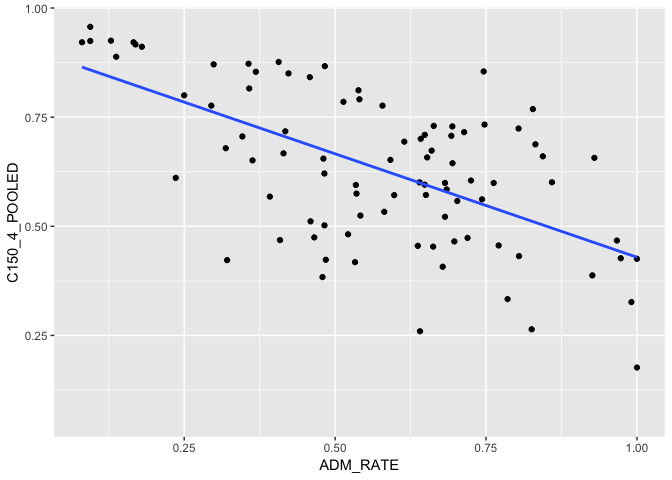

## Instructions
This exam is designed to show me what you have learned and where there are problems. You may use your notes and anything from the `class_files` folder, but please no internet searches. You have 35 minutes to complete as many of these exercises as possible on your own, and 10 minutes to work with a partner.  

At the end of the exam, upload the complete .Rmd file to your GitHub repository.  

```r
##install.packages("skimr")
```

1. Load the tidyverse.

```r
##install.packages("tidyverse")
```


```r
library(tidyverse)
library(skimr)
```


2. For these questions, we will use data about California colleges. Load the `ca_college_data.csv` as a new object called `colleges`.

```r
college<-
  readr::read_csv(file = "/Users/clmuser/Documents/GitHub/jadeoku91311/data/ca_college_data.csv")
```

```
## Parsed with column specification:
## cols(
##   INSTNM = col_character(),
##   CITY = col_character(),
##   STABBR = col_character(),
##   ZIP = col_character(),
##   ADM_RATE = col_double(),
##   SAT_AVG = col_double(),
##   PCIP26 = col_double(),
##   COSTT4_A = col_double(),
##   C150_4_POOLED = col_double(),
##   PFTFTUG1_EF = col_double()
## )
```


3. Use your preferred function to have a look at the data and get an idea of its structure.

```r
glimpse(college)
```

```
## Observations: 341
## Variables: 10
## $ INSTNM        <chr> "Grossmont College", "College of the Sequoias", "C…
## $ CITY          <chr> "El Cajon", "Visalia", "San Mateo", "Ventura", "Ox…
## $ STABBR        <chr> "CA", "CA", "CA", "CA", "CA", "CA", "CA", "CA", "C…
## $ ZIP           <chr> "92020-1799", "93277-2214", "94402-3784", "93003-3…
## $ ADM_RATE      <dbl> NA, NA, NA, NA, NA, NA, NA, NA, NA, NA, NA, NA, NA…
## $ SAT_AVG       <dbl> NA, NA, NA, NA, NA, NA, NA, NA, NA, NA, NA, NA, NA…
## $ PCIP26        <dbl> 0.0016, 0.0066, 0.0038, 0.0035, 0.0085, 0.0151, 0.…
## $ COSTT4_A      <dbl> 7956, 8109, 8278, 8407, 8516, 8577, 8580, 9181, 92…
## $ C150_4_POOLED <dbl> NA, NA, NA, NA, NA, NA, 0.2334, NA, NA, NA, NA, 0.…
## $ PFTFTUG1_EF   <dbl> 0.3546, 0.5413, 0.3567, 0.3824, 0.2753, 0.4286, 0.…
```


4. What are the column names?

```r
colnames(college)
```

```
##  [1] "INSTNM"        "CITY"          "STABBR"        "ZIP"          
##  [5] "ADM_RATE"      "SAT_AVG"       "PCIP26"        "COSTT4_A"     
##  [9] "C150_4_POOLED" "PFTFTUG1_EF"
```


5. Are there any NA's in the data? If so, how many are present and in which variables?

```r
college %>% 
  purrr::map_df(~ sum(is.na(.))) %>%
  tidyr::gather(variables, num_nas) %>% 
  arrange(desc(num_nas))
```

```
## # A tibble: 10 x 2
##    variables     num_nas
##    <chr>           <int>
##  1 SAT_AVG           276
##  2 ADM_RATE          240
##  3 C150_4_POOLED     221
##  4 COSTT4_A          124
##  5 PFTFTUG1_EF        53
##  6 PCIP26             35
##  7 INSTNM              0
##  8 CITY                0
##  9 STABBR              0
## 10 ZIP                 0
```


6. Which cities in California have the highest number of colleges?

```r
college %>% 
  filter(STABBR == "CA") %>% 
  group_by(CITY) %>% 
  summarize(TOTAL = n()) %>% 
  arrange(desc(TOTAL))
```

```
## # A tibble: 159 x 2
##    CITY          TOTAL
##    <chr>         <int>
##  1 Los Angeles      24
##  2 San Diego        18
##  3 San Francisco    15
##  4 Sacramento       10
##  5 Berkeley          9
##  6 Oakland           9
##  7 Claremont         7
##  8 Pasadena          6
##  9 Fresno            5
## 10 Irvine            5
## # … with 149 more rows
```


7. The column `COSTT4_A` is the annual cost of each institution. Which city has the highest cost?


8. The column `ADM_RATE` is the admissions rate by college and `C150_4_POOLED` is the four-year completion rate. Use a scatterplot to show the relationship between these two variables. What does this mean?

```r
college %>% 
  ggplot(aes(ADM_RATE, C150_4_POOLED))+
  geom_point()+
  geom_smooth(method=lm, se=FALSE)
```

```
## Warning: Removed 251 rows containing non-finite values (stat_smooth).
```

```
## Warning: Removed 251 rows containing missing values (geom_point).
```

<!-- -->


9. The column titled `INSTNM` is the institution name. We are only interested in the University of California colleges. Run the code below and look at the output. Are all of the columns tidy? Why or why not? 
# No, some columns are variables but not characters

```r
univ_calir <-
  college %>% 
  filter_all(any_vars(str_detect(.,pattern = "University of California")))
univ_calir
```

```
## # A tibble: 10 x 10
##    INSTNM CITY  STABBR ZIP   ADM_RATE SAT_AVG PCIP26 COSTT4_A C150_4_POOLED
##    <chr>  <chr> <chr>  <chr>    <dbl>   <dbl>  <dbl>    <dbl>         <dbl>
##  1 Unive… La J… CA     92093    0.357    1324  0.216    31043         0.872
##  2 Unive… Irvi… CA     92697    0.406    1206  0.107    31198         0.876
##  3 Unive… Rive… CA     92521    0.663    1078  0.149    31494         0.73 
##  4 Unive… Los … CA     9009…    0.180    1334  0.155    33078         0.911
##  5 Unive… Davis CA     9561…    0.423    1218  0.198    33904         0.850
##  6 Unive… Sant… CA     9506…    0.578    1201  0.193    34608         0.776
##  7 Unive… Berk… CA     94720    0.169    1422  0.105    34924         0.916
##  8 Unive… Sant… CA     93106    0.358    1281  0.108    34998         0.816
##  9 Unive… San … CA     9410…   NA          NA NA           NA        NA    
## 10 Unive… San … CA     9414…   NA          NA NA           NA        NA    
## # … with 1 more variable: PFTFTUG1_EF <dbl>
```


10. Use `separate()` to separate institution name into two new columns "UNIV" and "CAMPUS".


11. As a final step, remove `Hastings College of Law` and `UC San Francisco` and store the final data frame as a new object `univ_calif_final`.


12. The column `ADM_RATE` is the admissions rate by campus. Which UC has the lowest and highest admissions rates? Please use a barplot.


## Knit Your Output and Post to [GitHub](https://github.com/FRS417-DataScienceBiologists)
